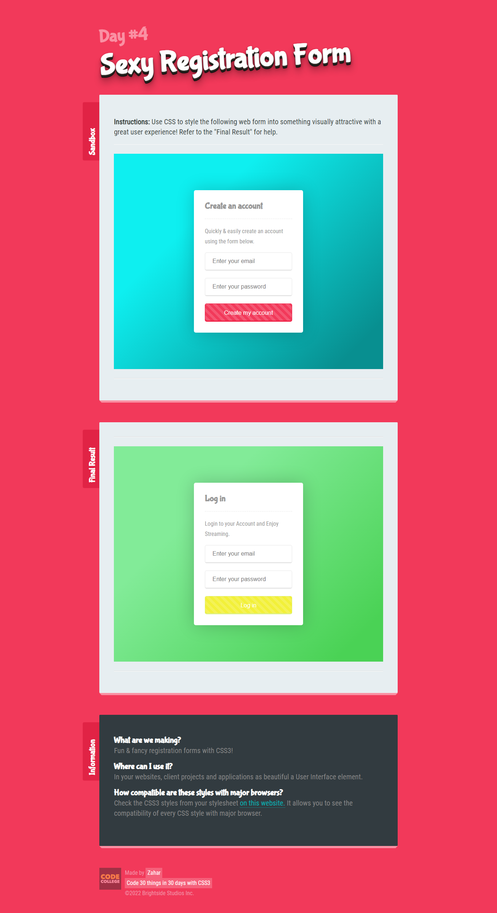

# Registration-Form

Css Styling with functionality:

1) Create Account
2) Log in

Key areas:

1) transform: scale(0.9) translate(0, 0);

2)  background-image: linear-gradient(45deg,   rgba(255, 255, 255, 0.15) 25%, rgba(0, 0, 0, 0) 25%,
                                               rgba(0, 0, 0, 0) 50%,rgba(255, 255, 255, 0.15) 50%, 
                                               rgba(255, 255, 255, 0.15) 75%, rgba(0, 0, 0, 0) 75%,
                                               rgba(0, 0, 0, 0));
   
    background-size: 20px 20px, 100% 100%;

3) :hover{
    background-size: 40px 40px;
    }
    
4) background-image: linear-gradient(135deg, #0eeff0 30%, #088f90 90%);    

